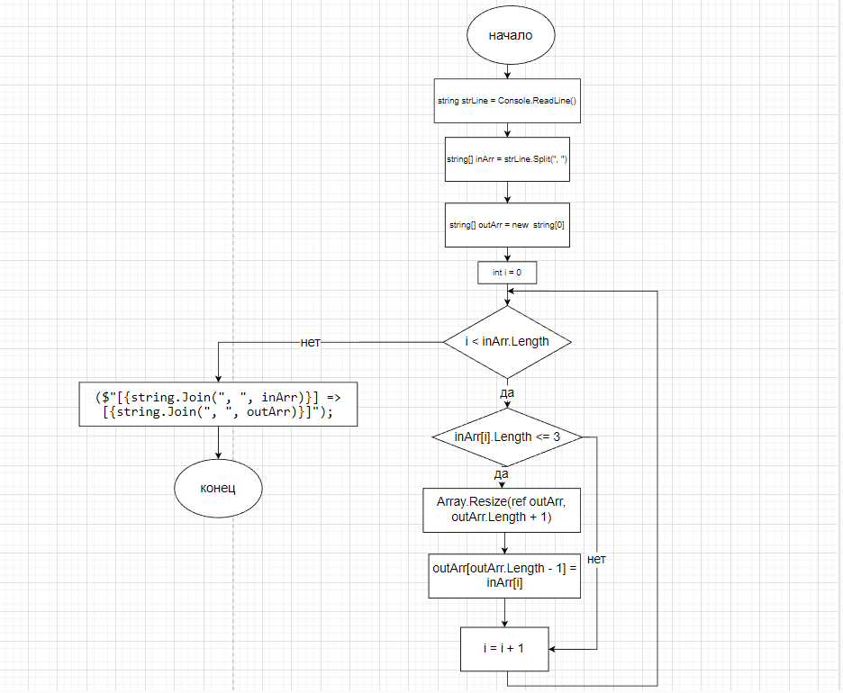

# Контрольная работа
## Список задач:
1. Создать репозиторий на GitHub
2.Нарисовать блок схему алгоритма
3. Снабдить репозиторий оформленным текстовым описанием (файл Readмe.md)
4. Написать программу, решающую поставленную задачу
5. Использовать контроль версий в работе над этим небольшим проектом (не должно быть так что все залито одним коммитом, как минимум этап 2, 3 и 4 должны быть расположены в разных коммитах)

## Решение:
1. Репозиторий на GitHub: 
2. Блок-схема: 

3. Файл Readme.md:
4. Решение задачи:
5. Коммиты: 